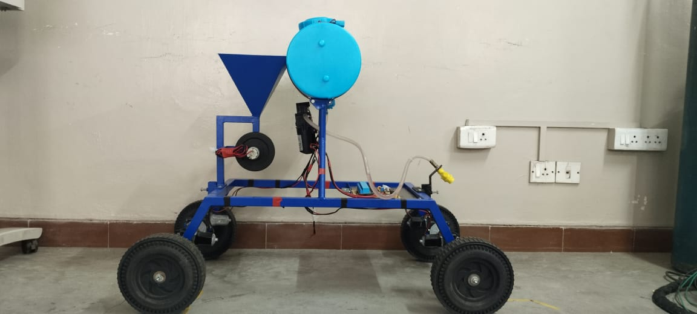
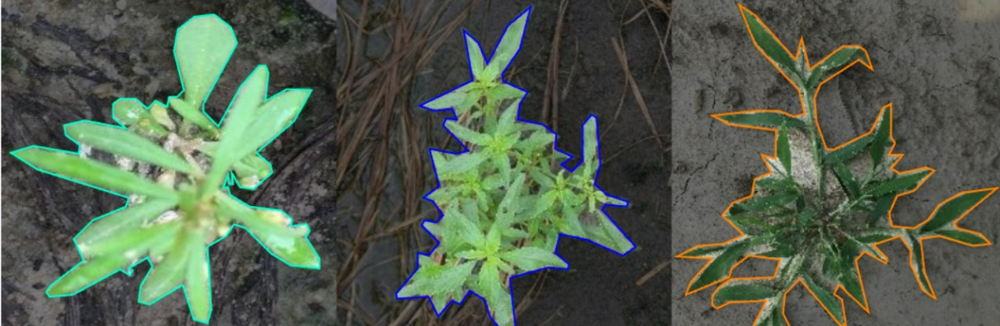
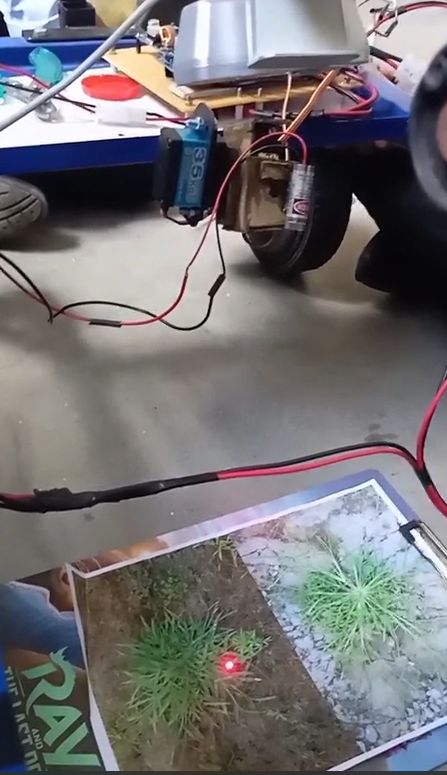

# Deep Learning–Based Laser Weed Removal System

## Sustainable Agricultural & Forest Automation Rover

---

## Project Overview

This project presents the design, fabrication, and implementation of a deep learning–based agricultural rover capable of:

- **Laser-based selective weed removal** (non-chemical)
- **Automated seed dispensing**
- **Targeted fertilizer spraying**
- **Real-time weed detection** using YOLOv11 deep learning

The system aims to provide a **cost-effective, scalable, and eco-friendly solution** for small and medium-scale farms, reducing labor dependency and chemical herbicide usage while improving crop yield and sustainability.



---

## Key Objectives

- Implement real-time weed detection and classification using deep learning
- Enable precision laser weed elimination without harming crops
- Integrate automated seed sowing and fertilizer spraying
- Reduce environmental impact and operational costs
- Support Sustainable Development Goals (SDG 2 & SDG 12)

---

## System Architecture

### Hardware Architecture

| Component                 | Specifications                                                           |
| ------------------------- | ------------------------------------------------------------------------ |
| **Raspberry Pi 4**        | 4GB RAM - Runs YOLOv11 model, processes camera feed, hosts Flask backend |
| **ESP32 Microcontroller** | Handles low-level control, communicates via REST APIs over Wi-Fi         |
| **Camera Module**         | Real-time video capture for weed detection                               |
| **Laser Module**          | Pan-tilt mechanism (servo-driven) for precise weed targeting             |
| **DC Motors**             | Rover movement control                                                   |
| **Seed Dispenser**        | Servo-controlled hopper for automated seed sowing                        |
| **Fertilizer System**     | Pump and spray nozzle for targeted fertilizer application                |


### Software Stack

- **Backend**: Flask (Python) on Raspberry Pi
- **Deep Learning**: YOLOv11 (Nano version)
- **Frontend**: React Native + Expo (Mobile App)
- **Communication**: REST APIs, HTTP/WebSocket
- **Microcontroller**: Arduino IDE (ESP32)

---

## Deep Learning Model

### Model Details

**YOLOv11n (Nano version)**

- Optimized for real-time inference on embedded devices
- Multi-scale object detection
- SPFF (Spatial Pyramid Pooling Fast)
- C2PSA spatial attention mechanism
- High FPS with low computational cost



### Weed Classes (16 Total)

The model detects and classifies the following common agricultural weeds:

- Palmer Amaranth
- Carpetweed
- Crabgrass
- Morning Glory
- Nutsedge
- Ragweed
- Waterhemp
- (and 9 more varieties)

### Performance Metrics

| Metric           | Value |
| ---------------- | ----- |
| **mAP@0.5**      | ~91%  |
| **FPS**          | ~24   |
| **Precision**    | >80%  |
| **Recall**       | ~74%  |
| **Mask mAP@0.5** | ~79%  |



---

## Project File Structure

```
agribot/
├── README.md                          # Project documentation
├── app.json                           # Expo app configuration
├── package.json                       # Node.js dependencies
├── tsconfig.json                      # TypeScript configuration
├── tailwind.config.js                 # Tailwind CSS configuration
├── nativewind-env.d.ts               # NativeWind type definitions
├── metro.config.js                    # Metro bundler configuration
├── babel.config.js                    # Babel transpiler configuration
├── eslint.config.js                   # ESLint configuration
├── axiosconfig.js                     # Axios HTTP client configuration
├── eas.json                           # Expo Application Services config
├── expo-env.d.ts                      # Expo environment types
├── global.css                         # Global stylesheet
│
├── app/                               # React Native app directory
│   ├── _layout.tsx                    # App layout/navigation
│   └── index.tsx                      # Home screen
│
├── assets/                            # Static assets
│   ├── fonts/
│   │   └── SpaceMono-Regular.ttf      # Custom font
│   └── images/
│       ├── adaptive-icon.png
│       ├── favicon.png
│       ├── icon.png
│       ├── iconagri.png              # Agriculture-themed icon
│       ├── partial-react-logo.png
│       ├── react-logo.png
│       ├── react-logo@2x.png
│       ├── react-logo@3x.png
│       └── splash-icon.png
│
└── media/                             # Project media resources
    ├── rover.jpg                      # Rover hardware image
    ├── laser.png                      # Laser system diagram
    ├── motor_actuator.jpg             # Motor actuation system
    └── weed.jpg                       # Weed detection sample
```

---

## Getting Started

### Prerequisites

- **Node.js** (v16+)
- **npm** or **yarn**
- **Python 3.8+** (for Raspberry Pi backend)
- **Expo CLI**

### Installation

1. **Clone the repository**

   ```bash
   git clone https://github.com/yourusername/agribot.git
   cd agribot
   ```

2. **Install dependencies**

   ```bash
   npm install
   ```

3. **Configure environment variables**

   - Update `axiosconfig.js` with your Raspberry Pi IP address
   - Set the appropriate API endpoints for Flask backend

4. **Run the app**
   ```bash
   npx expo start
   ```

---

## API Communication

### HTTP Configuration

To allow HTTP requests in the Expo app (for development with local servers):

**In `app.json` (iOS):**

```json
{
  "ios": {
    "infoPlist": {
      "NSAppTransportSecurity": {
        "NSAllowsArbitraryLoads": true
      }
    }
  }
}
```

**In `app.json` (Android):**

```json
{
  "android": {
    "usesCleartextTraffic": true
  }
}
```

**Using Axios (in `axiosconfig.js`):**

```javascript
import axios from "axios";

const instance = axios.create({
  baseURL: "http://192.168.1.100:5000", // Replace with Raspberry Pi IP
  timeout: 10000,
});

export default instance;
```

---

## Features

### 1. Real-time Weed Detection

- Live camera feed processing
- YOLOv11-based classification
- High accuracy detection with minimal latency

### 2. Precision Laser Control

- Servo-driven pan-tilt mechanism
- Accurate targeting of detected weeds
- Safe operation within crop areas

### 3. Automated Seed Dispensing

- Servo-controlled hopper
- Programmable seed distribution
- Variable rate application

### 4. Smart Fertilizer Spraying

- Targeted spray application
- Integration with weed detection
- Adjustable spray patterns

### 5. Mobile Control Interface

- React Native frontend
- Real-time monitoring dashboard
- Manual override capabilities

---

## Workflow

```
Camera Input
    ↓
YOLOv11 Detection
    ↓
Classification & Localization
    ↓
Decision Engine
    ↓
├─→ Laser Targeting & Firing
├─→ Seed Dispensing
└─→ Fertilizer Spraying
    ↓
Rover Movement & Navigation
    ↓
Database Logging & Analytics
```

---

## Security & Safety

- Non-chemical weed removal (laser-based)
- Crop-safe detection algorithm
- Emergency stop mechanisms
- Secure communication protocols (HTTPS for production)
- Authentication for mobile app access

---

## Performance & Scalability

- **Energy Efficient**: Optimized for extended field operations
- **Scalable Design**: Can be deployed on multiple rovers
- **Data Logging**: Records all operations for analytics

---

## Sustainability Impact

This system directly contributes to:

- **SDG 2 (Zero Hunger)**: Improved crop yields through precision agriculture
- **SDG 12 (Responsible Consumption)**: Reduced chemical herbicide usage
- **Environmental Protection**: Lower carbon footprint, reduced water contamination
- **Economic Benefits**: Cost reduction in labor and chemical inputs

---


_"Sustainable agriculture powered by AI and automation"_
